## Day 1 "Wooo I love this"
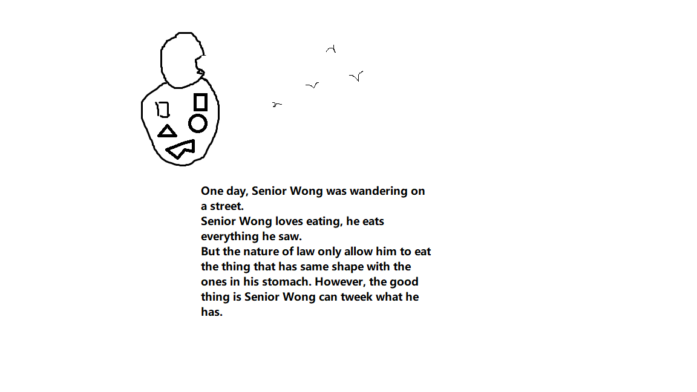
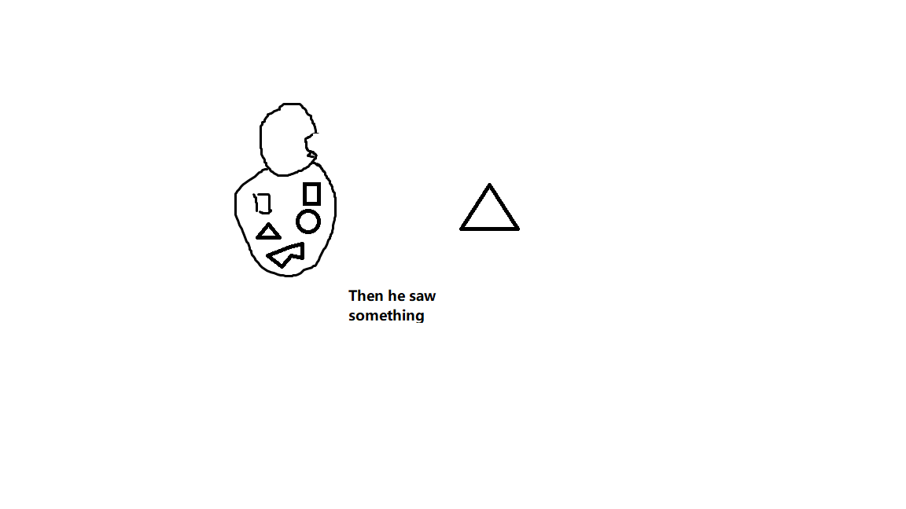
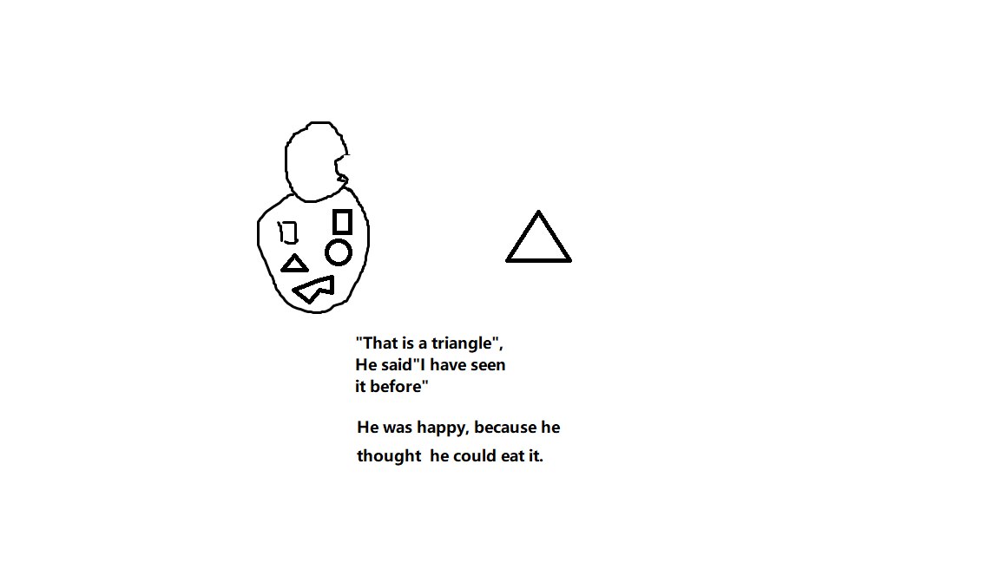
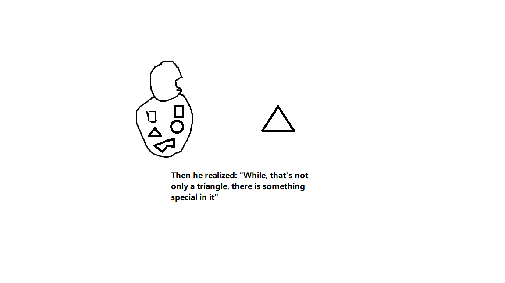
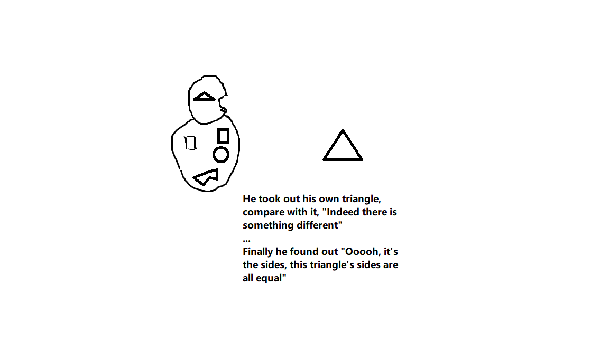
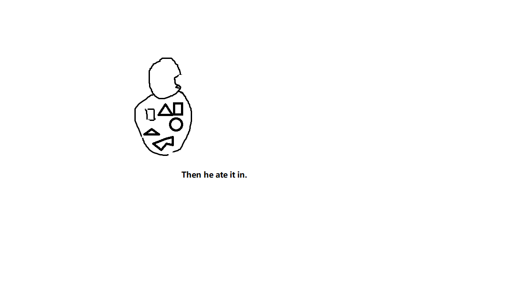

## Day 2 Ignore 
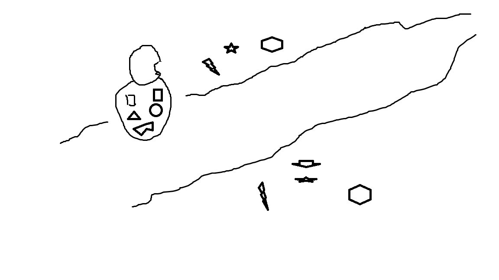
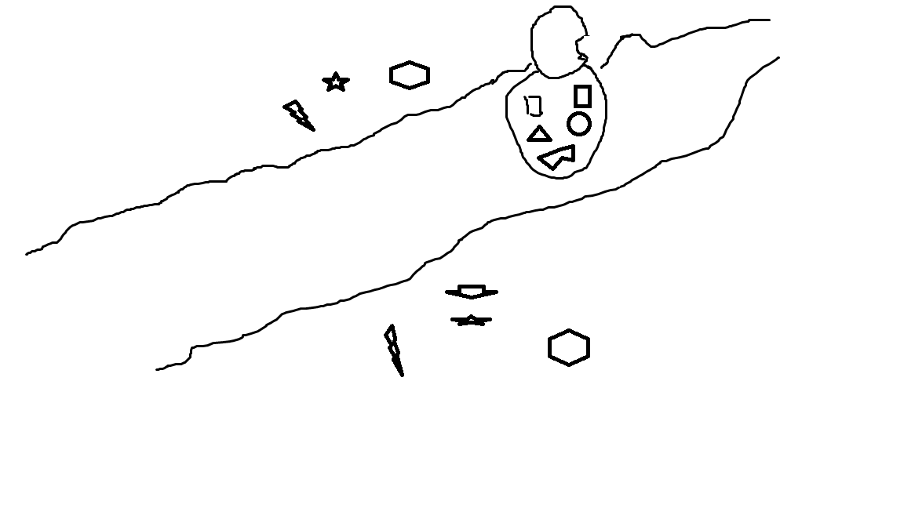
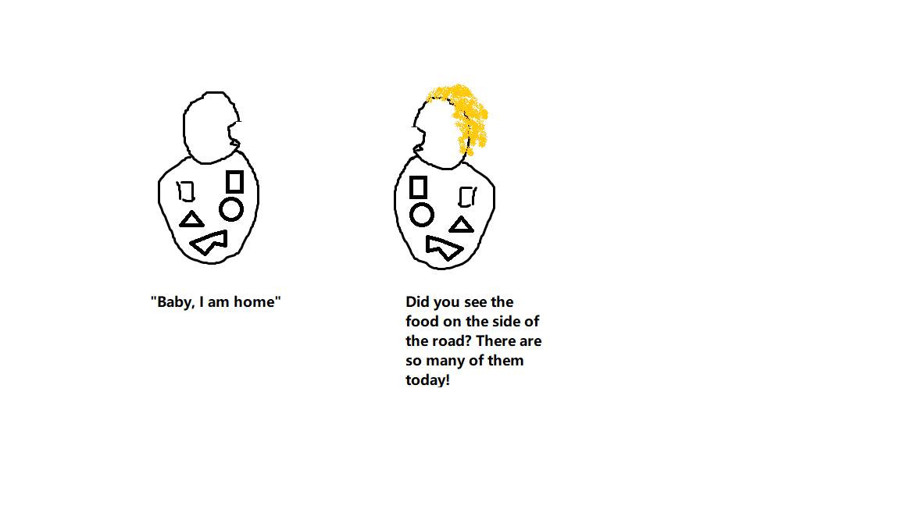
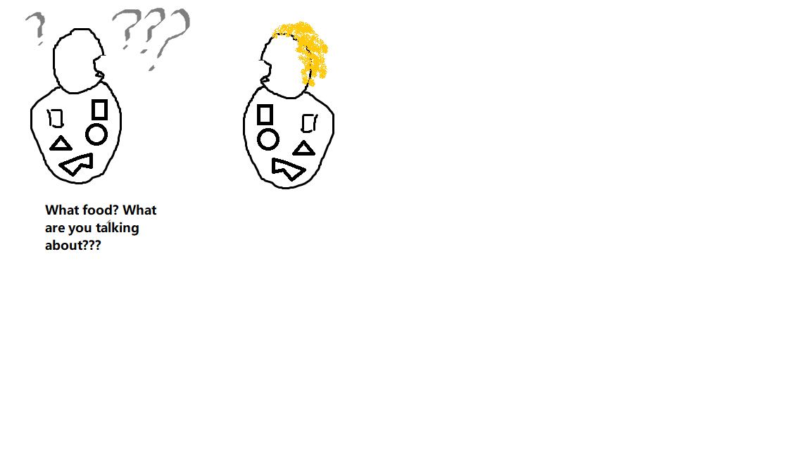

## Day 3 Never see it before
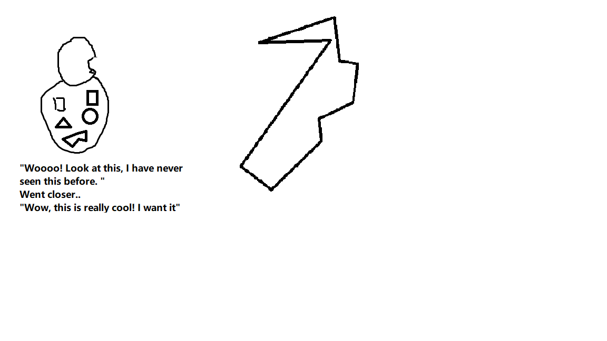

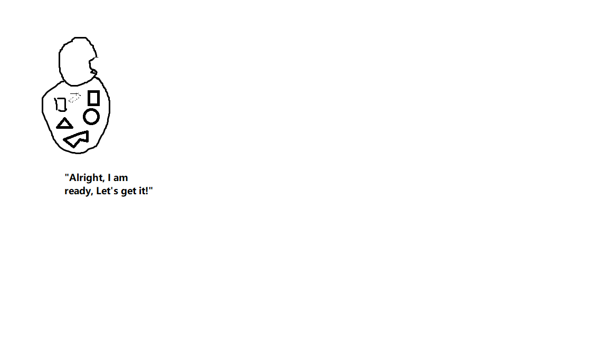

# Interest
Interest plays a significant role to the effectiveness of one's thinking and memorizing process, however, people tend to forget it very often. 

Here in Senior Wong's life, when he saw the triangle, he was happy, he was very interested. Why was he interested? From the first scene we know Senior Wong loves eating, so when the triangle appears in front of him, he realized he might have something to eat! This indeed is very important, this is the motivation that drives him to successfully think, understand and memorize as we will see in the later scene. 
So many times in our life some random thing: a book, a tool, a task, a person just jumps out in front of our eyes, then a random voice from somewhere came out: "Do this, read this, use this, finish this, talk with him". It happens so often that we even start tolerating and accepting it mindlessly as normal. At the back of it, a sense of lost is ensued. But NO! we have to jump up and defend "IT IS NOT NORMAL!". 

Like Senior Wong, we should know the answer to these questions: who we are, what we are interested in, why we are interested in them. When a thing accompanied with a command invade into our life, obeying silently won't really benefit anyone, we have to pick up the 'gun' and defend ourselves! 

Moreover, when something come to our life, we have to touch it, feel it and think about it by ourselves. For the reason that the increment of interest and touching is a spiral process. Just like Senior Wong's day 2 experience, if not doing it, everything we encounter in our life, will be like : "A lot of food along the street? What are you talking about?". We will be mindless about this world. 

Below are some 'guns' that you can use to defense against mindlessness:

Vision questions(This is what I learned from a leadership course, but it has been helpful in guiding me through different scenarios): 
1. What do we exist?
2. What does success look like?
3. What has to happen to achieve success?

Know-your-game questions: 
1. What's the backstroy of it?
2. Where am I now?
3. Where do I wanna go?

Also good questions:
1. How do I feel at this moment?
2. How much do I know about it?
3. How do I feel about it?
4. What's my intention here? (Share useful information; Have fun; Lead the culture;) 

# Just Thinking
## Memory retriving
In Senior Wong's Day One experience, a triangle is in his memory, but he still need some time to remember it, I mean, retrieve it. 
Part of the thinking process is memory retieving. In "How to solve it", Polya used this question to help student retrieve useful memory: "Here is the problem, can you think of a related problem?". So the next time you think about something, be generous to spare some minutes on remembering the related information. 

## Establish connection
The most rewarding moment for Senior Wong was when he realize the difference between his triangle the target triangle is the size, and by enlarging the size of his triangle he can get a same one as the target one. 

In "How to solve it", Polya mentioned "The main achievement in the solution of a problem is to conceieve the idea of a plan". In other words, solve a problem is about seeing a clear connection between the known and the unknown. So besides memory retrieving, connection establishment is important as well. Polya uses the following question to inspire his student: "Here is a problem related your prblem and solved before, can you use it?" 

Study it, I mean 'think' as you are studying it. By 'study' I mean for a scientific study, concerning about the nature, properties and principles of a subject. This study process also involves memory retrieving. 

There are 2 cases here, one is called memory oriented connection establishment. This happens when the study doesn't include unfamiliar external knowledge. Cue is the king in this game. If you have the right cue, you can have the right knowledge to conceive a plan. Nevertherless, it doesn't mean there is no new knowledge generated during this proess, previous knowledge point based new-emerging connection and refined understanding should still happen.

The other one is new knowledge oriented study. And this is what happens to Senior Wong in Day 3. New knowledge focused does not indicates the old knowledge will be discarded, on the contratry, knowledge stored in the memory are extremely important to build a solid understanding. There are 2 types of connection being established, one is inside the new knowledge itself, information organizing, chunking, working memory memorizing are required to support this. The other type is the connection between the new and old knowledge. The outcome of losing this type of connection is even you build a super organized and firm connection inside the new knowledge, sooner or later you will experience a sense of lost.  

(GRE reading, book reading experience about Benjamin Franklin & Intro to Embedded System)
