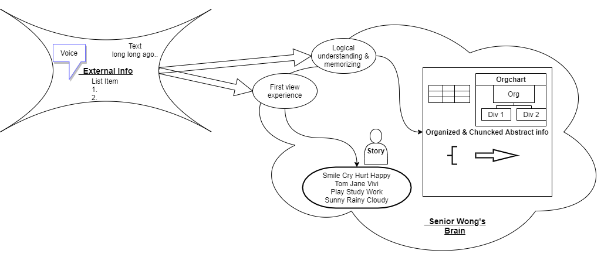
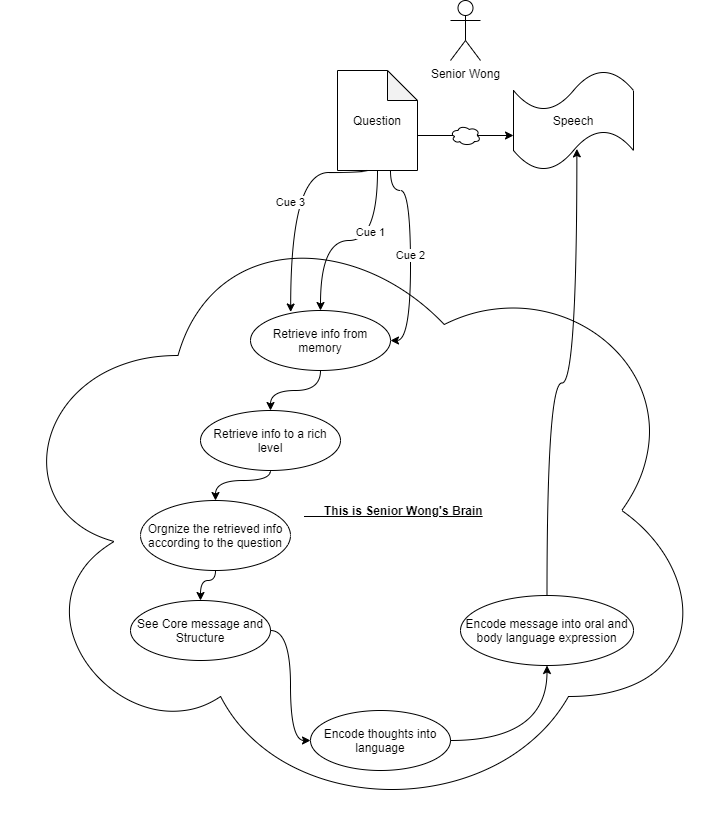

最近Senior Wong经历了一些‘迷茫’的痛，用数字（1-10）描述这痛感大概是3，6，8。用情景描述可能是去买早点找不到鸡蛋灌饼的摊位，大开洼开车蹦迪突然发现油烧尽，胸口中了一招梅超风的化骨绵掌。

用三个成语简单概括一下就是提笔忘字，无头苍蝇，哑口无言。
不知道各位同学是否也经历过以下的场景：拿起笔来要写作但发现脑袋里空空如也；站起身来开始讲话过程中突然发现不知道自己想讲什么；公共场合下被问到问题后不知说些什么而使整个场子陷入寂静。

Senior Wong最近全都经历了，但Senior Wong没有因此自甘堕落一蹶不振，他化悲痛为力量，野火烧不尽春风吹又生的对这三件事情进行了深入的自我剖析。惊喜的‘自创’了两个关于大脑思考表达的认知模型以及避免下次在同个坑里跌倒的内功心法。

# Cognative models # 
## Model #1: Text-Thoughts model ##

## Model #2: Question-Speech model ##

## Lesson #1: Pick the right cue ##
在Question-Speech这个模型里，第一个需要特别关注的环节是cue的选取。跳回公共场合回答问题的场景，Senior Wong拿到问题，大声的读了一遍问题。之后就陷入了一篇寂静，三四秒没有人声的寂静。

那这个时候在Senior Wong的大脑里到底发生了些什么呢？简单来讲就是，冻住了。Senior Wong觉得自己应该有对于这个问题的答案，但不知怎么的，就是没有任何的信息进入到脑海中。那种感觉，好像快要睡着了。大脑里面没有思绪在流动，是静止了的。Senior Wong的大脑这时候还在思考么？可能是没有了吧。
那问题在哪，是什么让Senior Wong本来活蹦乱跳的大脑进入了‘休眠’状态？
是那个问题。那个问题本身对于Senior Wong的大脑不是一个好的cue。这个问题没有行使出retrieve experience info from memory的功能，反而因为某些原因关闭了大脑。
但我们可以把这个cue换一换，换成一幅图片，一个场景图，或者一个特定的事件。相信就会好很多。
个人的经验是：用图片回忆经历，用logic flow回忆逻辑。

## Lesson #2: Be patient or Be prepared ##
耐心点儿，再耐心点儿。在回答问题这件事情上，人往往期待读完问题后立刻马上现在就要能够看到答案。有的时候甚至有这样的假设“嘿，这不是我感兴趣的话题么，这不是我曾经非常感动的东西么，我不是应该看到这个题目后0.1钟就已经开始讲话了么”。

而这个公共场合回答问题的场景，客观来讲对于Seinor Wong的大脑是非常有挑战性的。读完一遍问题，一两秒钟内，结合上面的Quesiton-Speech的模型，大脑内要完成以下的过程：“understand the question -find cues -retrieve from memory -retrieve info richly-organize info -see core message&structure -organize in language -organize in oral”。对于一个很新的问题，期待一两秒钟就完成这个思考过程是不现实的。 

除了设好期待，耐心的对待这个回忆的过程，Question-Speech 模型里有两个点特别需要被强调。
一个retrieve to rich level。看到问题后人往往下意识会去提取记忆，但容易忽略的一点是rich level这个程度。常常发生的是大脑还没有pop up足够的信息，就已经move on到下一个阶段去organize这些信息甚至锁定conclusion了。这样仓促的结果就是明明记忆有很多已经存在大脑中，但因为没有足够的时间去激活它们而在组织核心答案的时候没有能够利用上。想想其实蛮可惜的，之前花了大量的时间精力去理解和记忆，只是因为回忆的时间不够而没能让它们发挥该有的功效。

如果你说耐心对我来说太难了，那也有另外一个方法，就是你已经准备过类似的问题，而且当下大脑处于对相关内容非常熟悉的状况下。这也是为什么有考试或者面试时考生需要花大量的时间准备的。

另一个模型需要被强调的点是有意识的去组织这些被回忆起来的信息。回忆和组织，某种程度上是两个不同的阶段，记起来了某信息A并不代表改信息A就代表信息A有对当前问题的回答做出贡献。很有可能信息A当初是因为回答一个完全不同的问题而被储存起来。所以这时需要有意识地重新去理解和组织信息A让它真正能够服务问题。 

So，Either be patient or be prepared when you are thinking about a problem. 

## Lesson #3: Spend time on thought-to-speech encoding ##
和上面提取记忆阶段的问题不同，对于这个thought-to-speech的过程，很多时候人几乎没有可以的花时间在上面，以为这是一个不需要花精力的步骤。这样导致了分享或者写作过程中感觉内容信息很熟悉，但不知为何表达起来总是磕磕绊绊或是不自觉地纠正自己刚刚说过的话。重新看这个Question-Speech Model，很多信息在thoughts层面是以数学图像，画，公式，思维结构图甚至声音感觉的形式存在，与讲话时的语言，文字，话语的承载形式之间还是存在一个gap。举个例子就像一个人只看篮球比赛而从未摸过篮球，就算他把篮球技巧讲的再天花乱坠，也不会有人想要请他做教练。而thought-to-speech encoding就是一个把篮球知识和场上得分串联的阶段，想要准确流畅的表达自己的想法，这个过程必不可少。

## Lesson #4: Pick the right encoding mode when you can ##
是谈情还是谈钱？
在Text-Thoughts的模型当中大脑可以使用两种不同的方式来接受外界信息。逻辑的方式，或是体验者的方式。值得一提的是不同的信息接收方式会直接影响不同种类的信息在大脑中被储存。具体来讲就是如果Senior Wong被问了一个在场景A中个人体验的问题，而他从前身处场景A时一直在做逻辑思考，他就很难回答这个问题。因为这个信息从未进入过他的大脑。

如果你想讲故事给别人听，那就多用体验者的视角去感受。
相反如果你想告诉别人你的逻辑理论发现，那就多去从观察到的信息中进行抽象整理。